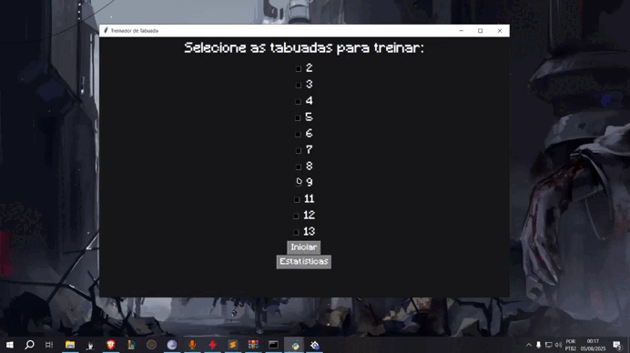
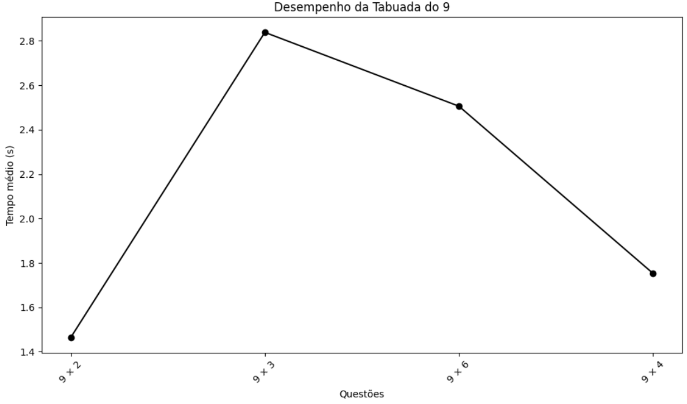

# times-table-speed
The fastest and most efficient way to learn and improve your multiplication speed. It's addictive!

<h1> preview </h1> 


<h1> purpose:</h1>
<p> i made this to test tkinter/matplot and streamlit (btw ended up not even using it)</p>

```The code has many bugs, but it serves your purpose (I probably won't fix).```
